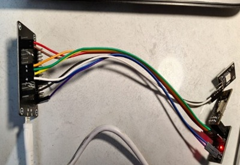

# Women-Safety-Band

##  Project Description
Women Safety Band is a wireless emergency alert system designed to improve women's safety. When the SOS button on the sender unit is pressed, an emergency signal is transmitted to the receiver unit, indicating that the woman is in danger and requires immediate assistance.

##  Features
- Wireless communication using ESP8266 and ESP-NOW
- SOS emergency button
- Instant emergency alert transmission
- Simple and low-power design
- Easy to use

##  Components Used
- ESP8266 (Sender)
- ESP8266 (Receiver)
- Push Button
- LED
- Jumper Wires
- USB Cable
- Power Supply

##  Working Principle
1. The user presses the SOS button.
2. The sender ESP8266 detects the button press.
3. The sender transmits an emergency signal using ESP-NOW.
4. The receiver ESP8266 receives the signal.
5. The receiver turns ON the LED to indicate an emergency.

## Project Structure
```
Women-Safety-Band/
│
├── Sender/
│   └── sender_code.ino
│
├── Receiver/
│   └── receiver_code.ino
│
├── transmitter.jpeg
├── receiver.jpeg
└── README.md
```

## Project Images

### Sender Unit


### Receiver Unit


##  Future Improvements
- GPS Location Tracking
- GSM SMS Alert
- Mobile Application Integration
- Buzzer Alarm
- Rechargeable Battery

##  Developed By
**Thejas S R**
